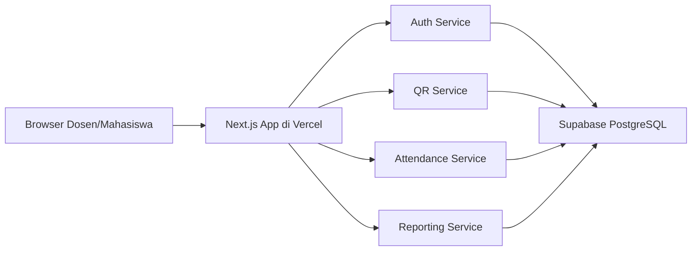

# Arsitektur Berbasis Layanan

## Ringkasan

Sistem Absensi QR dibangun sebagai aplikasi fullstack berbasis layanan. Next.js menjadi application service, sedangkan Supabase PostgreSQL menjadi database service yang terpisah dan berjalan di cloud.

## Diagram

## Pembagian Layanan

- Auth Service: autentikasi, role dosen/mahasiswa, dan session.
- QR Service: pembuatan token unik dan QR URL untuk sesi absensi.
- Attendance Service: validasi jadwal, peserta kelas, dan pencatatan absensi.
- Reporting Service: rekap daftar hadir dan export CSV.
- Database Service: penyimpanan data terpusat di Supabase PostgreSQL.

## Alasan Stack

- Next.js cocok untuk frontend dan backend ringan dalam satu project.
- Vercel cocok untuk deploy Next.js.
- Supabase menyediakan PostgreSQL cloud yang mudah dipantau lewat dashboard.
- Arsitektur ini tetap sederhana untuk presentasi, tetapi sudah menunjukkan pemisahan tanggung jawab layanan.
